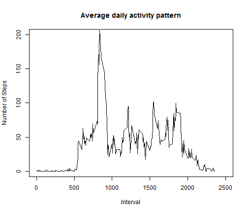
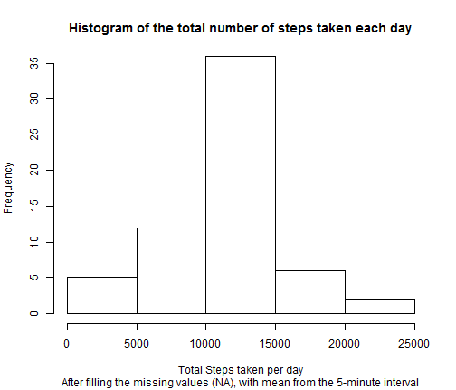
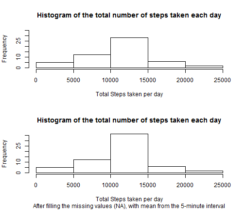
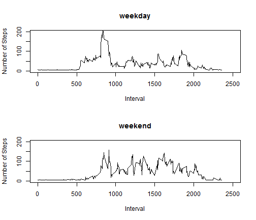

Reproducible Research\Peer Assessment 1
========================================================


## Loading and preprocessing the data

```r
# Load the data (i.e. read.csv())
activity = read.csv("activity.csv")
# Processing the data into a format suitable for analysis
data1 = ddply(activity, "date", function(x) c(TotalSteps = sum(x$steps)))
data2 = ddply(activity, "interval", function(x) c(AvgSteps = mean(x$steps, na.rm = TRUE)))
```


## What is mean total number of steps taken per day?

```r
# Histogram of the total number of steps taken each day
hist(data1$TotalSteps, main = "Histogram of the total number of steps taken each day", 
    xlab = "Total Steps taken per day", xlim = c(0, 25000), ylim = c(0, 35))
```

 

**For the total number of steps taken:**

- *the Mean is 1.0766 &times; 10<sup>4</sup> &*
- *the Median is 10765*

## What is the average daily activity pattern?

```r
# Time series plot of the 5-minute interval (x-axis) and the average number
# of steps taken, averaged across all days (y-axis)
plot(data2$interval, data2$AvgSteps, type = "l", xlim = c(0, 2500), ylim = c(0, 
    200), main = "Average daily activity pattern", xlab = "Interval", ylab = "Number of Steps")
```

 


On Average across all the days in the data set, **Interval 835** has the maximum number of steps

## Imputing missing values
The total number of missing values in the dataset (i.e. the total number of rows with NAs) are: **2304**

```r
# The NA are filled with the mean from the 5-minute interval and a new
# dataset is created
activity_NA_filled_w_Mean = activity
activity_NA_filled_w_Mean[is.na(activity_NA_filled_w_Mean)] <- mean(data2$AvgSteps, 
    na.rm = TRUE)
data3 = ddply(activity_NA_filled_w_Mean, "date", function(x) c(TotalSteps = sum(x$steps)))
```


```r
# Histogram of the total number of steps taken each day
hist(data3$TotalSteps, main = "Histogram of the total number of steps taken each day", 
    sub = "After filling the missing values (NA), with mean from the 5-minute interval", 
    xlab = "Total Steps taken per day", xlim = c(0, 25000), ylim = c(0, 35))
```

 


**For the total number of steps taken:**

- *the Mean is 1.0766 &times; 10<sup>4</sup> &*
- *the Median is 1.0766 &times; 10<sup>4</sup>*

### Difference between estimates

```r
# Differ between the estimates from the first part of the assignment!
par(mfrow = c(2, 1))
hist(data1$TotalSteps, main = "Histogram of the total number of steps taken each day", 
    xlab = "Total Steps taken per day", xlim = c(0, 25000), ylim = c(0, 35))
hist(data3$TotalSteps, main = "Histogram of the total number of steps taken each day", 
    sub = "After filling the missing values (NA), with mean from the 5-minute interval", 
    xlab = "Total Steps taken per day", xlim = c(0, 25000), ylim = c(0, 35))
```

 


Frequency between the range of steps 10000 and 15000 has increased from a frequency of 25 to 35. Comparing the mean from the 2 estimates, there is no significant change.

Mean of Estimate1: **1.0766 &times; 10<sup>4</sup>**  vs Mean of Estimate2: **1.0766 &times; 10<sup>4</sup>**

## Are there differences in activity patterns between weekdays and weekends?

```r
# Creating new factor variable in the dataset with two levels - 'weekday'
# and 'weekend' indicating whether a given date is a weekday or weekend day.
activity_NA_filled_w_Mean$day = weekdays(as.Date(activity_NA_filled_w_Mean$date))
data3$day = weekdays(as.Date(data3$date))
activity_NA_filled_w_Mean$weekday = NA
data3$weekday = NA

# Creating factors Weekend and Weekday
activity_NA_filled_w_Mean[row.names(subset(activity_NA_filled_w_Mean, day %in% 
    c("Saturday", "Sunday"))), "weekday"] = "weekend"

activity_NA_filled_w_Mean[row.names(subset(activity_NA_filled_w_Mean, !(day %in% 
    c("Saturday", "Sunday")))), "weekday"] = "weekday"

data3[row.names(subset(data3, day %in% c("Saturday", "Sunday"))), "weekday"] = "weekend"
data3[row.names(subset(data3, !(day %in% c("Saturday", "Sunday")))), "weekday"] = "weekday"

# Creating Dataset for Weekday and Weekend analysis
data_weekday = subset(activity_NA_filled_w_Mean, weekday == "weekday")
data4 = ddply(data_weekday, "interval", function(x) c(AvgSteps = mean(x$steps, 
    na.rm = TRUE)))
data_weekend = subset(activity_NA_filled_w_Mean, weekday == "weekend")
data5 = ddply(data_weekend, "interval", function(x) c(AvgSteps = mean(x$steps, 
    na.rm = TRUE)))
```

  
### Comparison between Weekday and Weekend on the Average number of steps taken per day

```r
# Time series plot (i.e. type = 'l') of the 5-minute interval (x-axis) and
# the average number of steps taken, averaged across all weekday days or
# weekend days (y-axis).
par(mfrow = c(2, 1))
plot(data4$interval, data4$AvgSteps, type = "l", xlim = c(0, 2500), ylim = c(0, 
    200), main = "weekday", xlab = "Interval", ylab = "Number of Steps")
plot(data5$interval, data5$AvgSteps, type = "l", xlim = c(0, 2500), ylim = c(0, 
    200), main = "weekend", xlab = "Interval", ylab = "Number of Steps")
```

 


